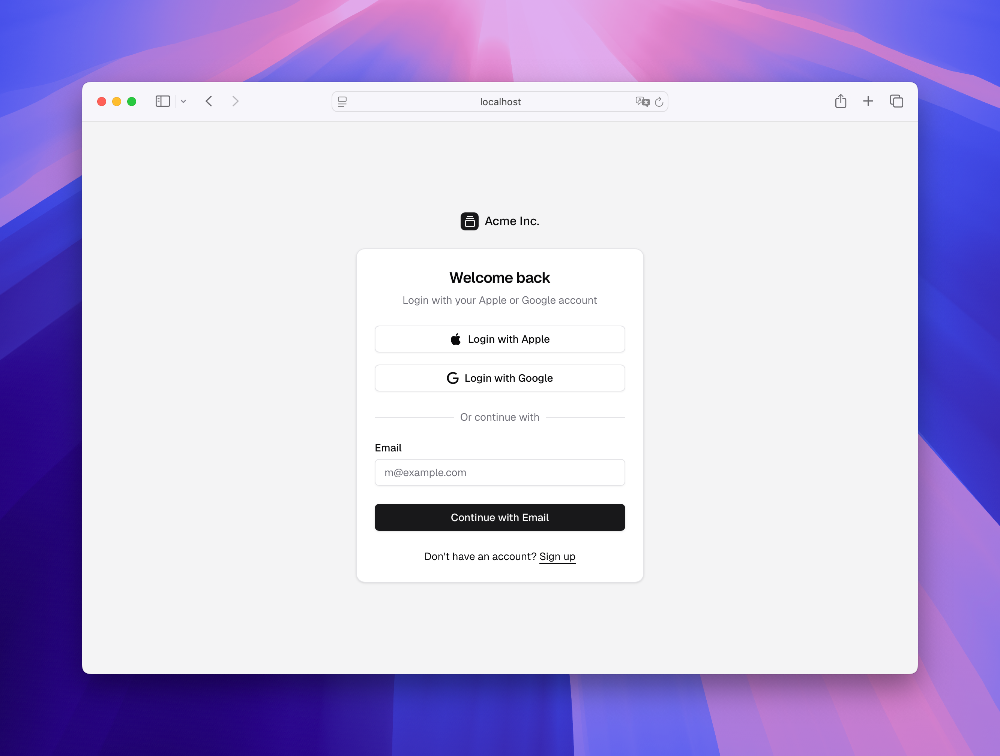
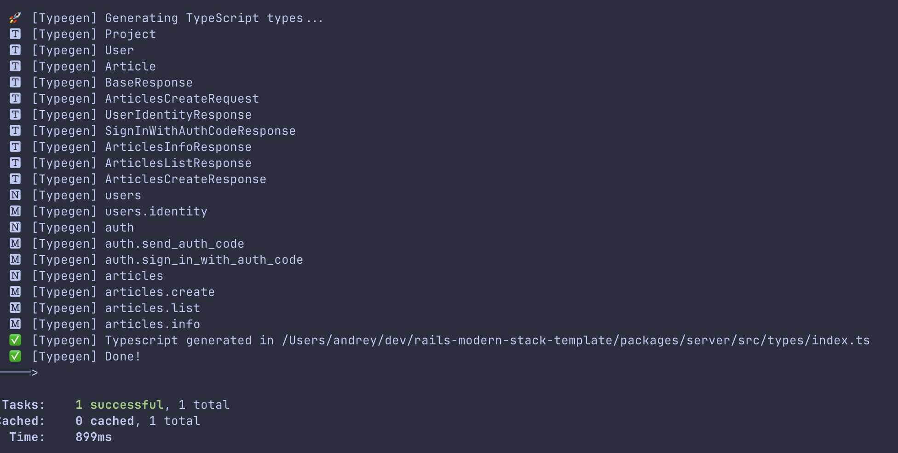

# 🚀 Rails Modern Stack Template

Say goodbye to Rails frontend drama.  
This monorepo template is designed for building a full-stack application using **Ruby on Rails**, **TypeScript**, **React**, **Next.js**, **Shadcn**, and **Tailwind CSS**.



---

## Features
- 🛠️ **TypeScript API Client** with type generation for the frontend.
- 🔑 Prebuilt **Login Page** with magic code authentication.
- 📄 Example of using the generated API client.
- 📦 **Next.js Monorepo Setup** for seamless integration.
- ⚡ **React Query** for efficient data fetching and caching.

---

## Prerequisites
- 💎 **Ruby** 3.2.2
- 🟢 **Node.js** 22
- 🐘 **PostgreSQL**
- 📦 **PNPM**

---

## 🚧 Getting Started

### Install Dependencies
    
```bash
cd rails-modern-stack-template
pnpm install
```

### Setup the Database
```bash
  cd apps/server
  bundle install
  rails db:create
  rails db:migrate
  rails db:seed
```

### Start the Application
Run all services from the root directory:
```bash
  pnpm run dev
```

Open your browser and go to `http://localhost:3000`
Use `dev@dev.com` and after clicking on the login button, use the magic code from the console to log in.


## 🛡️ Type Generation (Typegen)
Typegen is the core of this setup, helping you write backend code faster by automatically generating TypeScript API clients and types. When you define your API methods in Ruby on Rails, Typegen takes care of creating the matching TypeScript types and API client methods.

This eliminates the need for repetitive code, keeps things in sync between the backend and frontend, and helps you avoid errors. With Typegen, you can focus on the actual logic instead of manually handling API client code, making it an essential part of the workflow.

---

Define your API endpoints in apps/server/app/controllers/api.
For example:
```ruby
api_method 'users.identity', response: UserIdentityResponseSerializer
def identity
  render_resource(UserIdentityResponseSerializer, user: current_user, ok: true)
end
```

And the corresponding serializer in `apps/server/app/serializers/user_identity_response_serializer.rb`:
```ruby
class UserIdentityResponseSerializer < BaseResponseSerializer
  has_one :user, resource: UserSerializer

  type(
    user: [UserSerializer, optional: true]
  )
end
```

This will generate the following TypeScript types:
```typescript
export interface UserIdentityResponse {
  user?: User | null
}

export type User = {
  id: string,
  email: string,
  projects: Project[]
}

```

And API client methods:

```typescript

export class Api<SecurityDataType extends unknown> extends HttpClient<SecurityDataType> {
  users = {
    identity: (data: any, params: RequestParams = {}) =>
      this.request<UserIdentityResponse>({
        path: 'users.identity',
        method: "POST",
        body: data,
        secure: true,
        type: ContentType.Json,
        format: "json",
        ...params,
      }),
  }
}

```

Generate types by running:
```bash
pnpm run typegen
```



## Links & mentions
- Pretty much inspired by [campsite](https://github.com/campsite/campsite)
- [Shadcn monorepo docs](https://ui.shadcn.com/docs/monorepo) How to add custom packages etc.